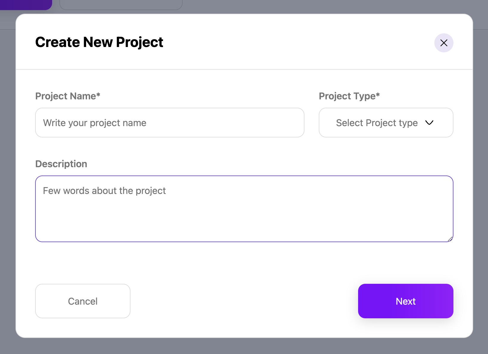

## Home Page Options

On the home page, users have two primary options to start a project:

1. **Create a New Project**

2. **Choose from Templates**

***

### Option 1: Create a New Project

#### Step 1: Project Information

* The user selects **Create Project**.

* The first step requires the user to enter project details:

  * **Project Name**: A unique name for the project.

  * **Project Type**: Options include:

    * `ERC20`

    * `NFT`

    * `dojSolTransfer`

    * `dojSolDataTransfer`

  * **Description**: A brief description of the project. (optional)

#### Step 2: Chain Selection

* The user selects at least one chain from the available options and create.
  

#### Project Created

* The project is successfully created, and the user is redirected to **XChain Connections** to view and manage the newly created project.
  

***

### Option 2: Create a Project from Templates

* Alternatively, the user may choose **Templates** from the home page instead of creating a project from scratch.
  

* The user can browse and select from existing templates to create a new project and user is redirected to xchain-connections.
  

***

### Next: Projects

The **Projects** section allows users to view, manage, edit and delete an existing projects. Users can explore detailed information about each project and make changes as necessary.

### Project Details

The following fields are displayed for each project:

* **Project Name**: The name assigned to the project.

* **Chain**: The blockchain network associated with the project.

* **Type**: The project type (e.g., `ERC20`, `NFT`, `dojSolTransfer`, `dojSolDataTransfer`).

* **Status**: The current status of the project (e.g., Active, Inactive).

* **Owner**: The owner or creator of the project.

* **Created On**: The date the project was created.

