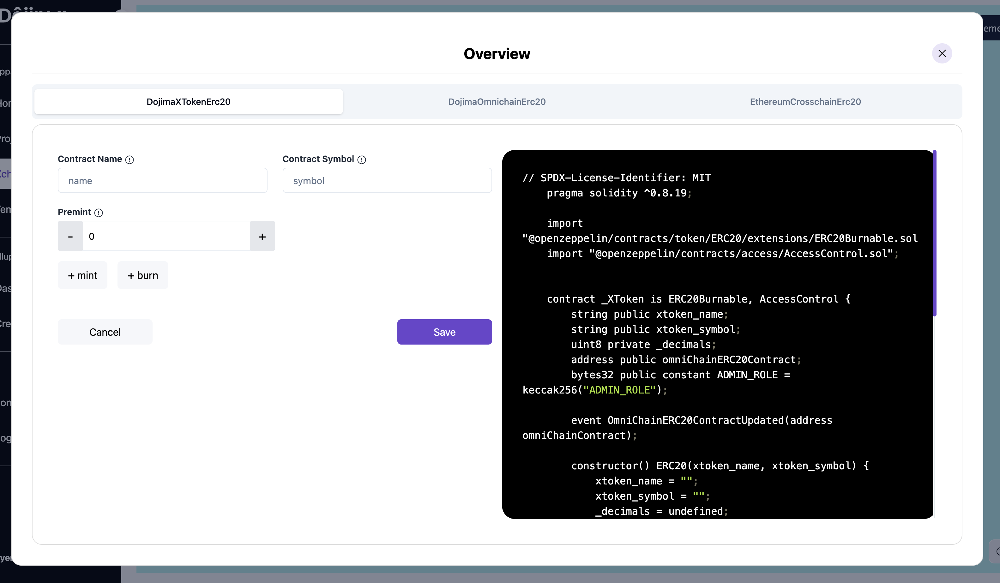
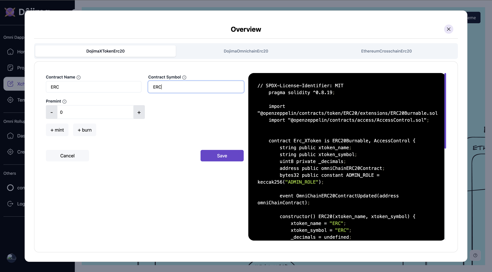
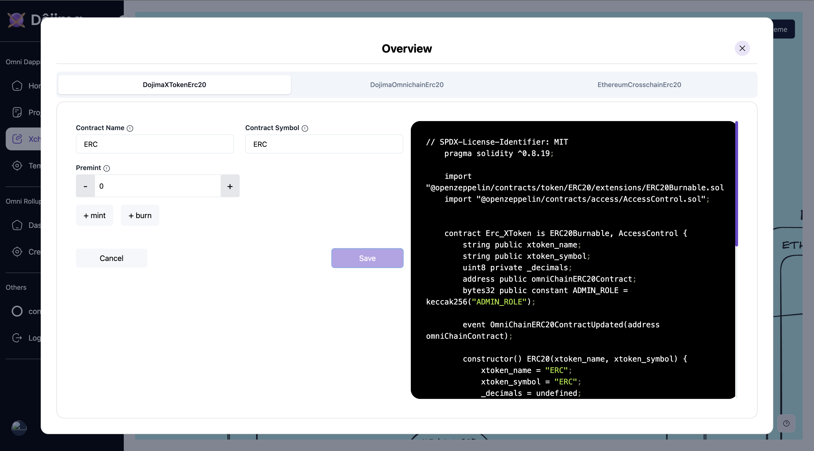
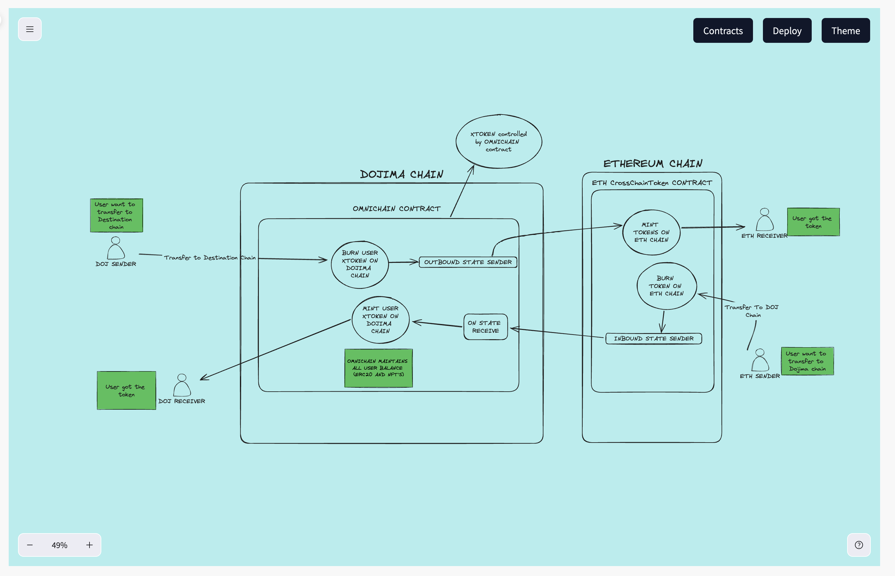
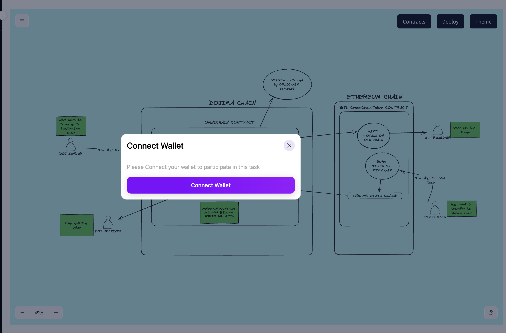
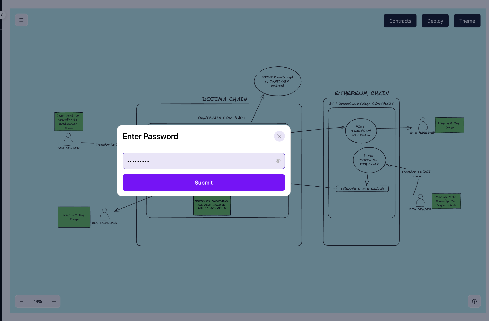
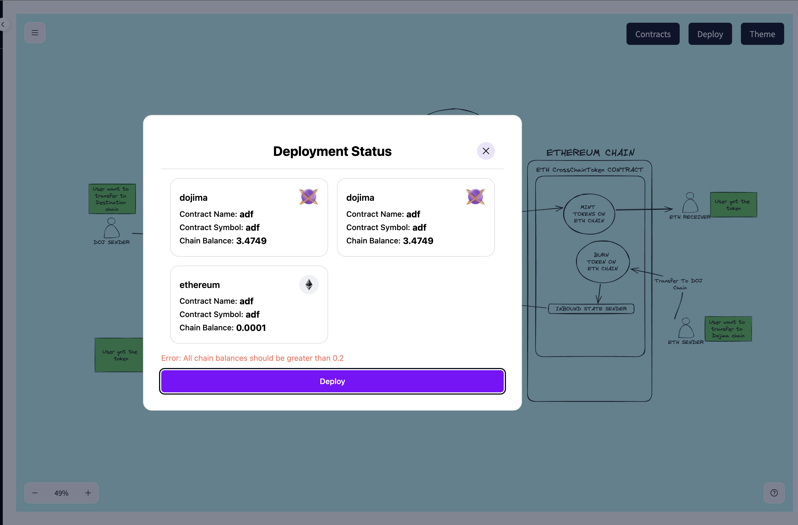
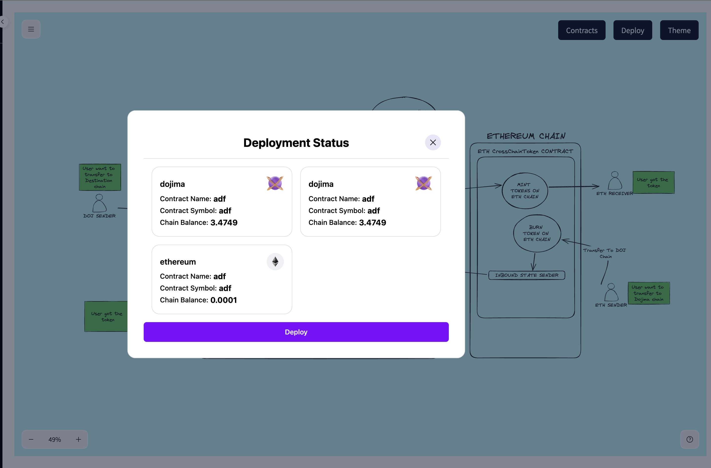
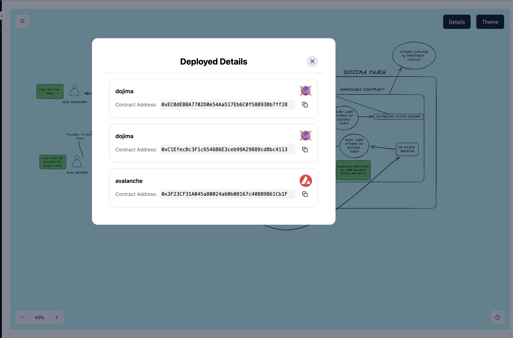

## Overview

The **XChain Connections** flow allows users to deploy cross-chain projects using a templated approach, ensuring all required configurations and inputs are completed before deployment.

***

### Steps to Deploy a Cross-Chain Project

1. **Head to XChain Connections**

   * After creating a new project or select from templates or selecting from the projects, the user is automatically redirected to the **XChain Connections** page to manage and deploy the project.
     

2. **Access Contracts**

   * In the **XChain Connections** page, head to **Contracts** located at the top-right corner.

   * A popup appears, prompting the user to enter specific inputs required for the cross-chain template deployment.
     

3. **Enter Input Details**

   - The user is asked to fill in all required fields in the popup.
   - **Important**: Ensure all inputs are correctly and consistently filled out before proceeding.
   

4. **Save Details**
   - Before moving to the next step, the user clicks **Save** to store the input details.
   

5. **Complete All Steps**

   * The user follows any remaining steps within the popup to complete the configuration.

   * Once all steps are finalized, the user closes the popup.

6. **Enable Deploy Button**

   * After completing and saving all input details, the **Deploy** button is enabled at the top right.
     

7. **Deploy the Project**

   - To deploy the project, the user clicks on the **Deploy** button.
   - The system prompts the user to connect to the [Dojima Wallet](https://chromewebstore.google.com/detail/dojima-wallet/bmcnjpgbhlegnmpmphhfealchlfifepj?hl=en-GB&utm_source=ext_sidebar) to complete the deployment process.
   
   

8. **Preview**

* To deploy the project, Accounts should maintain minimum balance of 0.2.
  

* Review the details and proceed to deployment.
  

***

After the deployment of the project head over to the **projects** section and select the deployed project and head to details to see the project details.

