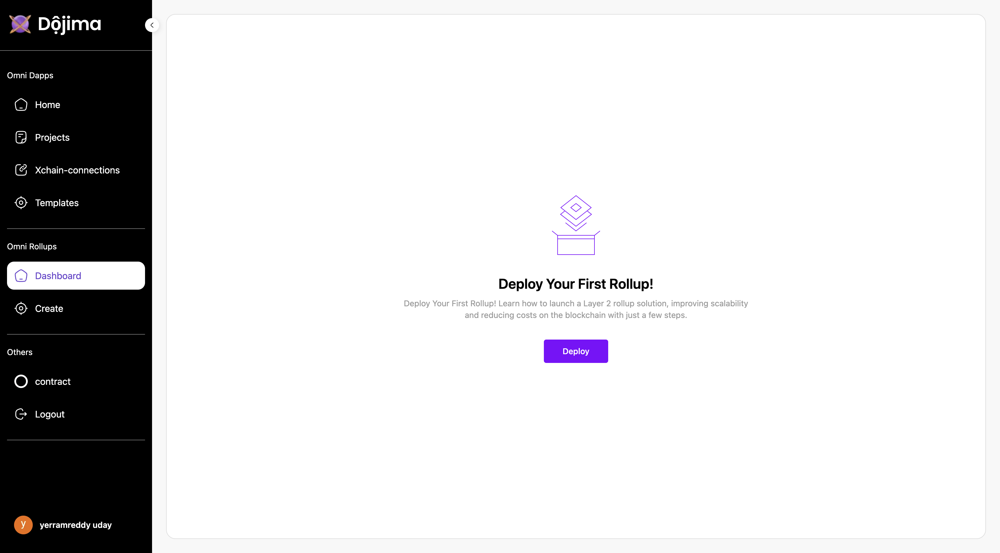
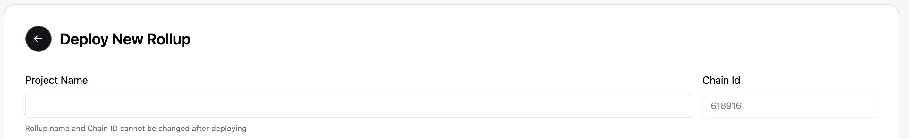
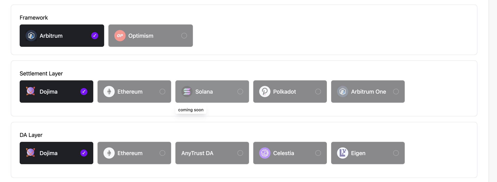
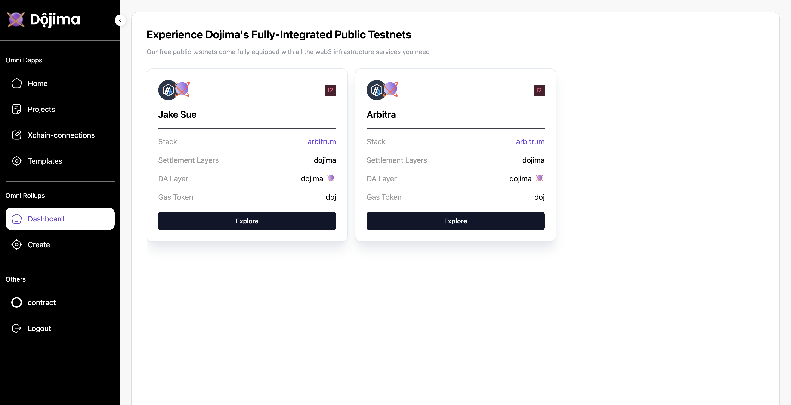
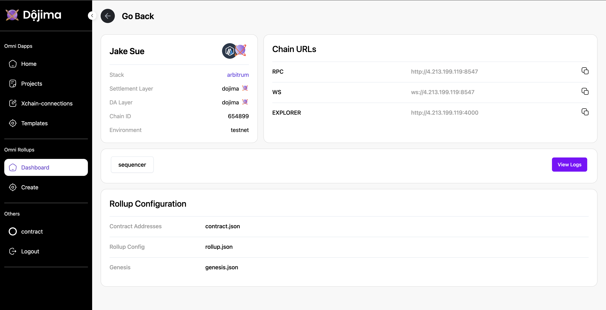

## Deploy your Rollup

The **OmniRollups** section enables users to create and deploy new rollups. If no rollup has been created yet, users can initiate a new rollup from the **Create** section.

### Steps for Deployment:

Head over to the official [Builder Marketplace](https://developer.dojima.network/) & click on "Deploy"

1. **Deploy New Rollup**: Click on the **Deploy** button to start the process.

2. **Enter Required Information**:
   - **Project Name**: Enter a unique name for the rollup.
   - **Chain ID**: A 6-digit Chain ID is generated automatically for each new rollup.
   
   - **Framework**: Select the rollup framework.
   - **Settlement Layer**: Choose list of settlement layers where the rollup will interact.
   - **DA Layer**: Select a Data Availability (DA) layer for secure data storage.
   - **Environment**: Select the environment for deployment.This includes Testnet and Mainnet(available soon)
   
   - **Note**: Currently only aribitrum rollup on top of dojima chain is supported.

   * **Project Name**: Enter a unique name for the rollup.

   * **Chain ID**: A 6-digit Chain ID is generated automatically for each new rollup.
     

This process will set up a new rollup with the specified configurations on the selected framework and da layer.

   * **Environment**: Select the environment for deployment.This includes Testnet and Mainnet(available soon)
     

2. **Continue and Deploy**: Once all inputs are configured, click on **Continue** to initiate rollup creation. Deployment will take a few moments to complete.

This process will set up a new rollup with the specified configurations on the selected framework and layer.

## Dashboard Preview

The **Dashboard** section provides an overview of all rollups created by the user. Each created rollup can be managed and explored in detail from this section.

### Exploring a Rollup

By clicking on **Explore**, users can view detailed information about a specific rollup.

* **Details**

* **Chain URLs**

* **Rollup Configuration**

* **View Logs**

